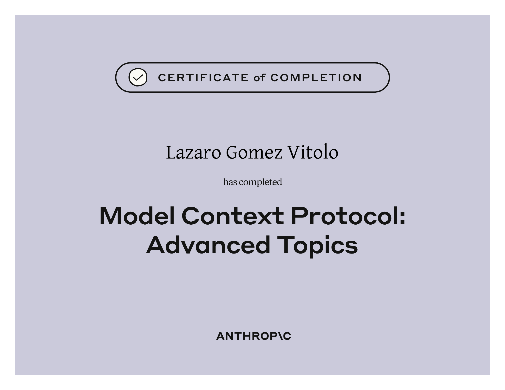
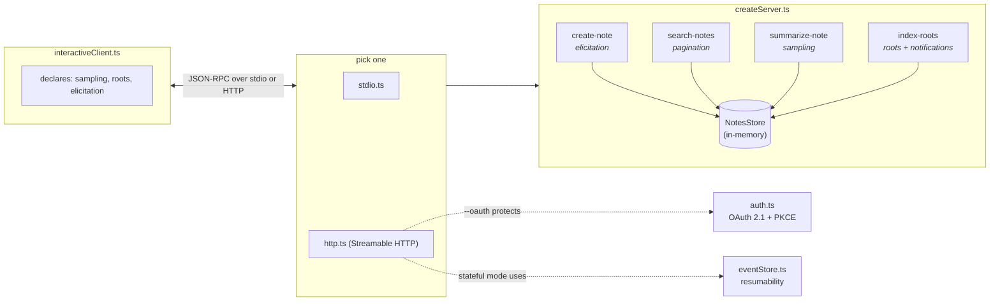
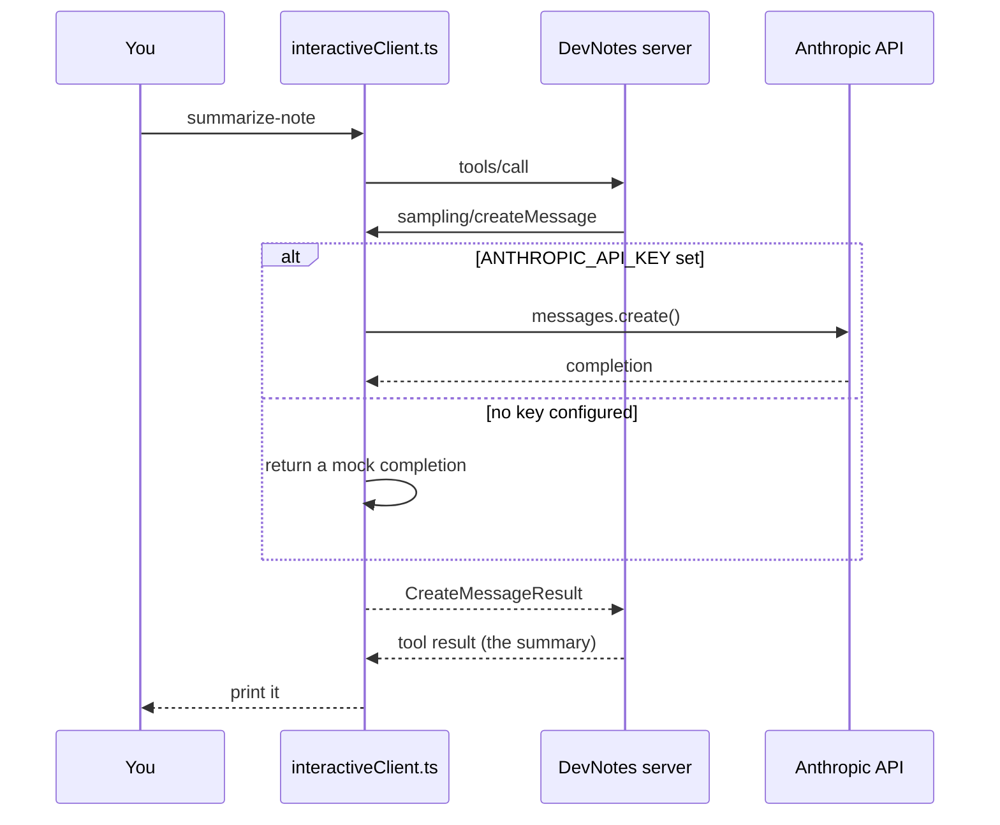

<div align="center">

# 🗒️ DevNotes MCP

**A notes server built to exercise every advanced feature of the Model Context Protocol.**

Follow-up project for Anthropic Academy's *Model Context Protocol: Advanced Topics* course.



</div>

## 🎓 What this is

DevNotes is a small, in-memory notes server — think a minimal Notion, exposed over MCP instead
of a web UI. It's deliberately not trying to be a real product; every tool exists to be a clean,
runnable example of one specific advanced MCP feature, and the notes themselves are just the
excuse to have something worth calling a tool *on*.

| Course topic | Where it lives |
|---|---|
| **Sampling** — server asks the client's LLM to do the work | [`summarize-note`](src/server/tools/summarizeNote.ts) |
| **Elicitation** — server pauses to ask the user something | [`create-note`](src/server/tools/createNote.ts) (priority, if omitted) |
| **Roots** — client grants the server a specific local folder | [`index-roots`](src/server/tools/indexRoots.ts) |
| **Progress & logging notifications** | also `index-roots`, via [`sendNotification`/`sendLoggingMessage`](src/server/tools/indexRoots.ts) |
| **Pagination** | [`search-notes`](src/server/tools/searchNotes.ts), cursor-based |
| **Structured output** | every tool returns `structuredContent` alongside its text |
| **stdio vs. Streamable HTTP transports** | [`stdio.ts`](src/server/stdio.ts) / [`http.ts`](src/server/http.ts) |
| **Resumable transport** | [`eventStore.ts`](src/server/eventStore.ts), stateful HTTP mode |
| **Stateless transport** | `http.ts --stateless` |
| **OAuth 2.1 + PKCE authorization** | [`auth.ts`](src/server/auth.ts), `http.ts --oauth` |

## 🏗️ Architecture



Sampling is the one genuinely bidirectional flow in the demo — the server calls back into
whichever process holds the model credentials — so it's worth seeing on its own:



The server never holds a model API key itself — that's the point of sampling. Only the
*client* in this diagram needs one, and only optionally (see [Quick start](#-quick-start)).

## 🚀 Quick start

```bash
npm install
cp .env.example .env   # optional — see below
```

Everything runs with zero configuration. `.env` only matters if you want real Claude
completions for `summarize-note` instead of a mocked one — set `ANTHROPIC_API_KEY` there.

**Local (stdio) — what Claude Desktop and the MCP Inspector use:**

```bash
npm run client            # spawns the server itself, opens an interactive prompt
# or, to poke at it directly:
npm run inspector
```

**Remote (Streamable HTTP):**

```bash
npm run start:http                # stateful, resumable — default
npm run start:http:stateless      # no session id, horizontally scalable
npm run start:http:oauth          # requires a bearer token (see below)
npm run start:http:oauth-strict   # + RFC 8707 resource-indicator enforcement

npm run client:http               # talk to whichever one is running on :3000
```

**Try roots** by pointing the client at the bundled example notes:

```bash
npm run client -- --root ./examples
# then call index-roots from the prompt
```

**Try the full OAuth flow:** run `npm run start:http:oauth`, then open the MCP Inspector
(`npx @modelcontextprotocol/inspector`) and connect to `http://127.0.0.1:3000/mcp` — its
built-in "Connect" flow walks through dynamic client registration, the authorization
redirect, and the PKCE token exchange for you. `auth.ts` has a header-comment listing
exactly what it does and doesn't do — it's a real OAuth 2.1 authorization server, but an
intentionally minimal one (in-memory storage, no real login screen); the same file explains
what a production deployment needs to add back.

## 📁 Project structure

```
src/
  server/
    createServer.ts     factory: builds one McpServer + registers all four tools
    store.ts             the in-memory NotesStore (create/search/importFromRoot)
    stdio.ts              entrypoint: stdio transport
    http.ts                entrypoint: Streamable HTTP, stateful/stateless/oauth
    auth.ts               demo OAuth 2.1 + PKCE authorization server
    eventStore.ts        in-memory EventStore for resumable HTTP
    tools/
      createNote.ts        elicitation
      searchNotes.ts       pagination
      summarizeNote.ts     sampling
      indexRoots.ts        roots + progress/logging notifications
  client/
    interactiveClient.ts  demo client: implements the handlers a server can call back into
examples/                sample notes for the index-roots demo
assets/                   the certificate this repo is a follow-up to
```

## 🔒 Notes on the security-relevant bits

- **Roots** are enforced entirely by the *client* — `store.importFromRoot` only ever reads
  the `file://` URI it's handed, one directory level deep, capped at 200 files / 200 KB each.
  The server never picks its own path.
- **`createMcpExpressApp`** enables DNS-rebinding protection automatically for `127.0.0.1` —
  see [`http.ts`](src/server/http.ts).
- **`auth.ts`** is explicitly a demo authorization server (see the header comment in that
  file for the exact list of what it skips). In a real deployment you'd almost always point
  `verifyAccessToken` at an existing IdP rather than writing one.
- Every server-initiated request (`createMessage`, `listRoots`, `elicitInput`) passes
  `relatedRequestId`, so responses route to the right session under concurrent HTTP load
  instead of the first one that happens to be listening.

## 🗺️ Learning path

Part of a series built while working through [Anthropic Academy](https://anthropic.skilljar.com/):

1. [`claude-api-starter`](https://github.com/Lazaro549/claude-api-starter) — Building with the Claude API
2. **`mcp-advanced-starter`** — MCP: Advanced Topics *(this repo)*
3. Claude Code in Action — next up

## 💸 Donations

- 🇦🇷 ARS (Argentina)
  Alias: `lazaro.503.alaba.mp`
- 🌎 USD (local transfers within Argentina only)
  Alias: `ahogada.duras.foca`

## License

MIT — see [LICENSE](LICENSE).
